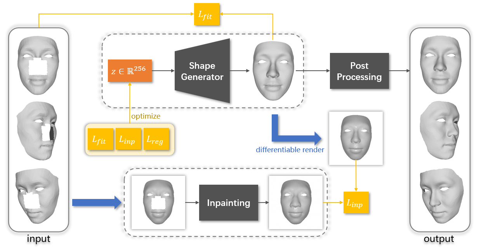
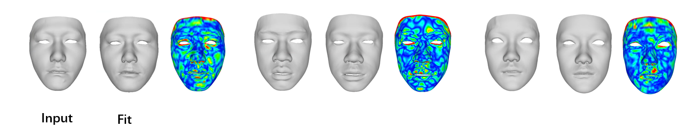
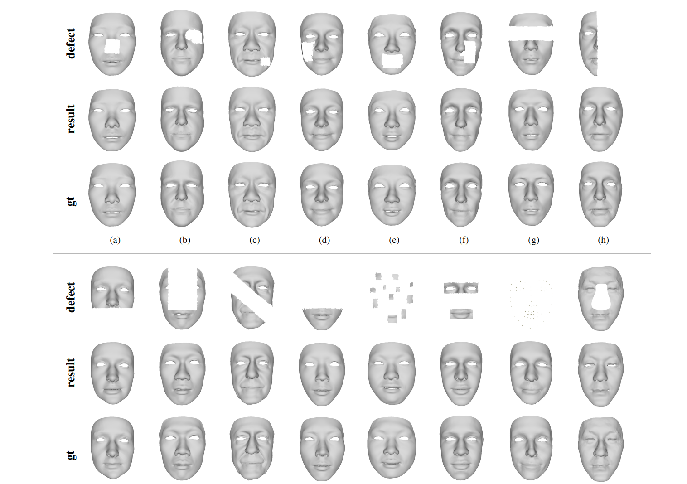

## FaceCom: Towards High-fidelity 3D Facial Shape Completion via Optimization and Inpainting Guidance

CVPR 2024

<br>

## Methods and Results

#### Method Overview



#### Fitting results with only Shape Generator



#### Shape completion results



<br>

## Set-up

1. Download code :

```
git clone https://github.com/dragonylee/FaceCom.git
```

2. Create and activate a conda environment :

```
conda create -n FaceCom python=3.10
conda activate FaceCom
```

3. Install dependencies using `pip` or `conda` :

- [pytorch](https://pytorch.org/get-started/locally/)

  ```
  pip3 install torch torchvision torchaudio --index-url https://download.pytorch.org/whl/cu118
  ```

- [pytorch3d](https://github.com/facebookresearch/pytorch3d/blob/main/INSTALL.md)

  ```
  conda install -c fvcore -c iopath -c conda-forge fvcore iopath
  pip install "git+https://github.com/facebookresearch/pytorch3d.git@stable"
  ```
  
- [torch_geometric](https://pytorch-geometric.readthedocs.io/en/latest/install/installation.html) & trimesh & [quad_mesh_simplify](https://github.com/jannessm/quadric-mesh-simplification)

  ```
  pip install torch_geometric trimesh quad_mesh_simplify
  ```

  You will find that after the installation, there is only `quad_mesh_simplify-1.1.5.dist-info` under the `site-packages` folder of your Python environment. Therefore, you also need to copy the `quad_mesh_simplify` folder from the [GitHub repository](https://github.com/jannessm/quadric-mesh-simplification) to the `site-packages` folder.

<br>

## Data

We trained our network using a structured hybrid 3D face dataset, which includes [Facescape](https://facescape.nju.edu.cn/) and [HeadSpace](https://www-users.york.ac.uk/~np7/research/Headspace/) datasets (under permissions), as well as our own dataset collected from hospitals. Due to certain reasons, the data we collected cannot be made public temporarily. Therefore, the method for training the model is not disclosed for the time being.

You can download our pre-trained model `checkpoint_decoder.pt` ([Google Drive](https://drive.google.com/file/d/1oPfWRPgCXjAffPJWfZyZyZOgd5EYPrHf/view?usp=drive_link)|[百度网盘](https://pan.baidu.com/s/1SsBW08yieLTCbK9ec6EnwA?pwd=z4vc)) and put it in `data` folder.

<br>

## Config

After downloading the pre-trained model, you need to modify the project path of the first three lines of `config/config.cfg` 

```
dataset_dir = PATH_TO_THE_PROJECT\data
template_file = PATH_TO_THE_PROJECT\data\template.ply
checkpoint_dir = PATH_TO_THE_PROJECT\data
```

to match your own environment. If you create a new config file using the provided `config.cfg`, these three parameters should respectively satisfy the following conditions:

1. `dataset_dir` should contain the `norm.pt` file (if you intend to train, it should include a `train` folder instead, with all training data placed inside the `train` folder).
2. `template_file` should be the path to the template file.
3. `checkpoint_dir` should be the folder containing the model parameter files.

The provided `config.cfg` file and the corresponding `data` folder can be used normally after downloading the pre-trained model described in [Data](#data).

<br>

## Usages

 After setting up the config file, you can thoroughly test with the scripts we provide below.

### Random Sample

Randomly generate `--number` 3D face models.

```
python scripts/face_sample.py --config_file config/config.cfg --out_dir sample_out --number 10
```

### Facial Shape Completion

**NOTE** that our method has some considerations and flaws to be aware of.

1. The unit of the face model is in millimeters.
2. The range of the facial model should preferably be smaller than the `template.ply` we provide, otherwise add  `--dis_percent 0.8` to achieve better results.
3. We use trimesh's ICP for rigid registration, but are unsure of its accuracy and robustness. You may perform precise rigid registration with `template.ply` first and set `--rr False`.

Then, you can run our script to perform shape completion on `--in_file`, 

```
python scripts/face_completion.py --config_file config/config.cfg --in_file defect.ply --out_file comp.ply --rr True
```

where `--in_file` is a file that trimesh can read, with no requirements on topology. We provide `defect.ply` for convenience.

### Mesh Fit / Non-rigid Registration

When the input is a complete facial model without any defects, the script in the "Facial Shape Completion" section will actually output a fitting result to the input. Since the topology of our method's output is consistent, it can also be used for non-rigid registration.

<br>

## Train

After preparing the dataset with unified topology, you can train a shape generator using the code we provided. First, determine a dataset folder path `A`, then create or modify the config file, changing the first three lines to

```
dataset_dir = A
template_file = A\template.ply
checkpoint_dir = A
```

You may pre-select the test data that will not be used for training, and then place the remaining training data in the `train` subfolder within the folder `A`. That is to say, before training, the directory structure of folder `A` should be as follows:

```
A/
├── train/
│   ├── training_data_1.ply
│   ├── training_data_2.ply
│   └── ...
```

Then you can start training using the script below:

```
python scripts/train.py --config_file config/config.cfg
```

During training, the structure of folder `A` will look like this, with the average of the training data generated as a template:

```
A/
├── train/
│   ├── training_data_1
│   ├── training_data_2
│   └── ...
└── template.ply
└── norm.pt
└── checkpoint_decoder.pt
```

These results are sufficient for the usage described in [Usages](#usages).

<br>

## Citations

If you find our work helpful, please cite us

```
@inproceedings{li2024facecom,
  title={FaceCom: Towards High-fidelity 3D Facial Shape Completion via Optimization and Inpainting Guidance},
  author={Li, Yinglong and Wu, Hongyu and Wang, Xiaogang and Qin, Qingzhao and Zhao, Yijiao and Wang, Yong and Hao, Aimin},
  booktitle={Proceedings of the IEEE/CVF Conference on Computer Vision and Pattern Recognition},
  pages={2177--2186},
  year={2024}
}
```

or

```
@article{li2024facecom,
  title={FaceCom: Towards High-fidelity 3D Facial Shape Completion via Optimization and Inpainting Guidance},
  author={Li, Yinglong and Wu, Hongyu and Wang, Xiaogang and Qin, Qingzhao and Zhao, Yijiao and Hao, Aimin and others},
  journal={arXiv preprint arXiv:2406.02074},
  year={2024}
}
```

